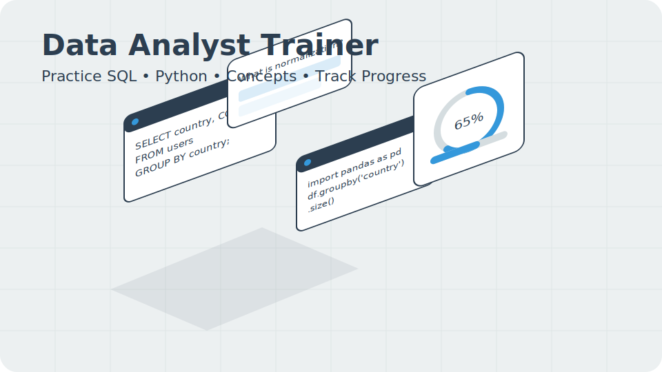
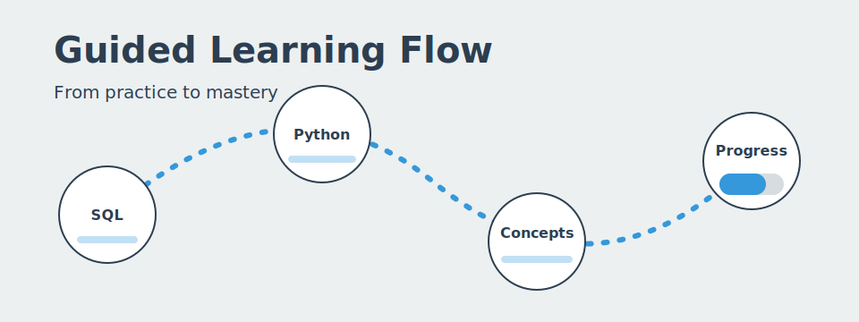
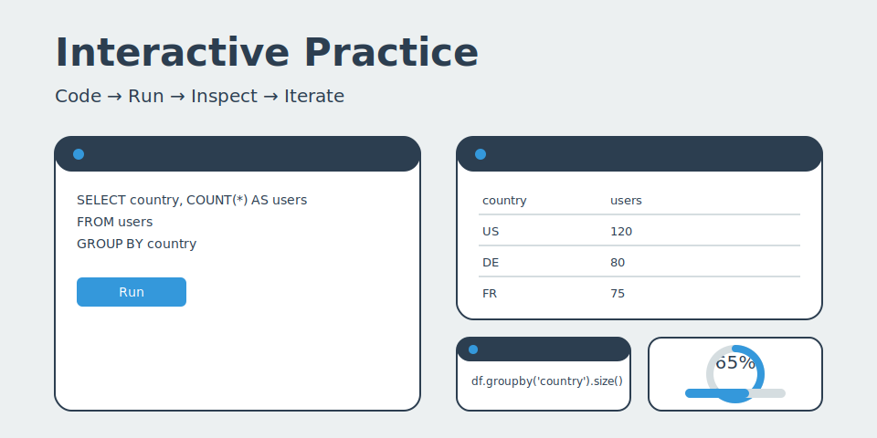
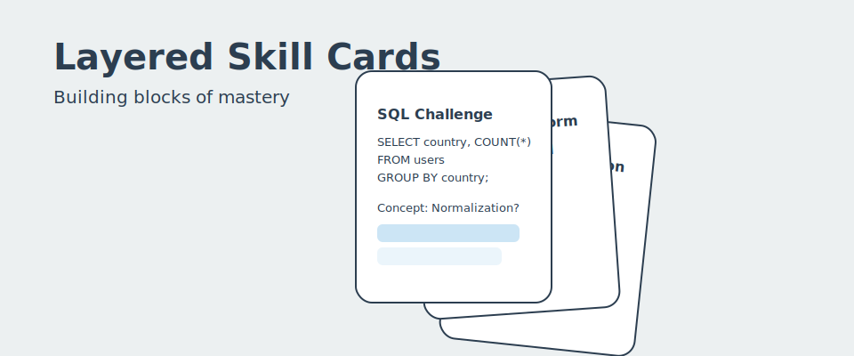
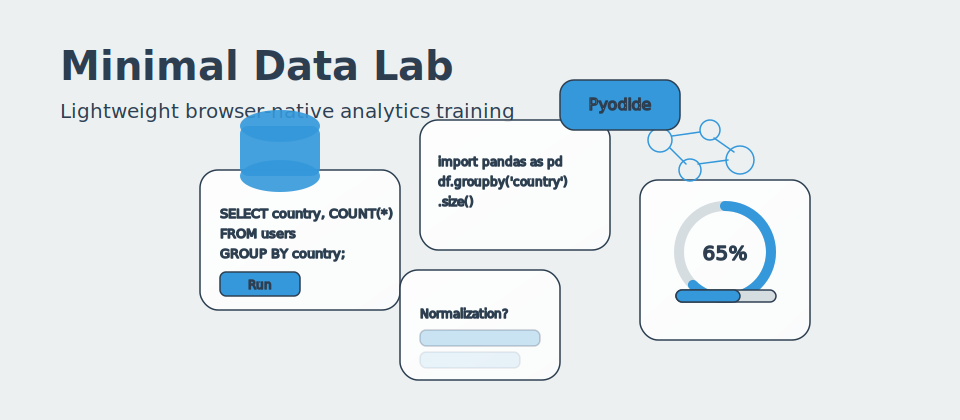

# Data Analyst Trainer

This presentation provides an overview of the Data Analyst Trainer project, a web-based application designed to help users improve their data analysis skills.

## Project Overview

The Data Analyst Trainer is a learning platform that provides a series of challenges to help users develop their skills in SQL, Python, and conceptual data analysis. The application is built using modern web technologies and provides an interactive and engaging learning experience.

## Visual Concepts Gallery

Below are multiple illustrative concepts you can use in slides, docs, or the app hero section. Each SVG is lightweight, accessible (title/desc), and aligned with the core palette (#2c3e50, #3498db, #ecf0f1, white).

| Concept | Preview | Alt Text |
| ------- | ------- | -------- |
| Isometric Dashboard |  | Isometric dashboard with SQL editor, Python console, conceptual quiz card and progress analytics donut. |
| Guided Learning Flow |  | Abstract connected node path from SQL to Python to Concepts to Progress. |
| Split Screen Interaction |  | Split layout with code editor, result grid, Python console and progress metrics. |
| Card Stack |  | Layered cards representing SQL challenge, Python transform, conceptual question and spaced repetition calendar. |
| Futuristic Lab |  | Floating translucent panels: SQL, Python, concept quiz, schema graph, progress analytics and technology chips. |

### Suggested Usage
* Hero section of README or landing page: Use the Isometric Dashboard or Futuristic Lab.
* Process explanation slide: Use the Guided Learning Flow.
* Feature deep dive: Use the Split Screen Interaction.
* Skills progression or pedagogy: Use the Card Stack.

### Embedding in React
For a hero banner (example):
```tsx
import hero from '/public/hero-isometric.svg';
export function Hero() {
	return (
		<section style={{padding: '3rem 2rem'}}>
			
		</section>
	);
}
```

### Optimization & Export Tips
* SVGs are already optimized for clarity; further minify with `svgo` if embedding inline.
* To export PNG for slide decks: open in a browser and export at 2x or 3x scale (or use Inkscape / Illustrator batch export).
* Maintain contrast: keep text over light backgrounds (#ecf0f1 / white) with slate (#2c3e50).
* You can recolor accent elements by searching `#3498db` and substituting a new brand hue.

### Theming Variant (Dark Mode Quick Edit)
To adapt for a dark theme, replace background `#ecf0f1` with `#1e2227`, card strokes `#2c3e50` with `#d5dde0`, and accent `#3498db` may remain or shift slightly brighter (e.g. `#3fa8f5`).

### Licensing Note
All SVGs here are original programmatic assets and may be used freely within this project and derivative presentation material.

## Key Features

*   **SQL Challenges**: Interactive SQL challenges that allow users to practice their query writing skills.
*   **Python Challenges**: Python-based challenges that cover data manipulation, analysis, and visualization.
*   **Conceptual Questions**: A series of multiple-choice and open-ended questions to test users' understanding of data analysis concepts.
*   **Progress Tracking**: A progress tracking system that allows users to monitor their performance and identify areas for improvement.

## Technologies Used

The Data Analyst Trainer is built using the following technologies:

*   **React**: A popular JavaScript library for building user interfaces.
*   **Vite**: A fast and lightweight build tool for modern web applications.
*   **TypeScript**: A typed superset of JavaScript that helps to improve code quality and maintainability.
*   **Monaco Editor**: A powerful code editor that provides a rich editing experience for SQL and Python.
*   **Pyodide**: A Python runtime that allows users to run Python code directly in the browser.
*   **sql.js**: A JavaScript library that provides a relational database in the browser.

## Next Steps

The following are the next steps in the development of the Data Analyst Trainer:

*   **Add more challenges**: Continue to add new and more complex challenges to the platform.
*   **Improve the user interface**: Enhance the user interface to provide a more intuitive and engaging learning experience.
*   **Add new features**: Add new features such as a leaderboard, social sharing, and the ability to create custom challenges.
